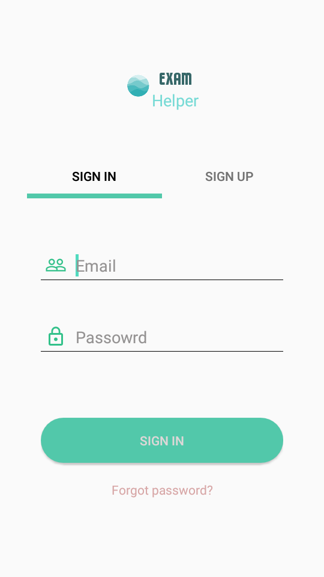
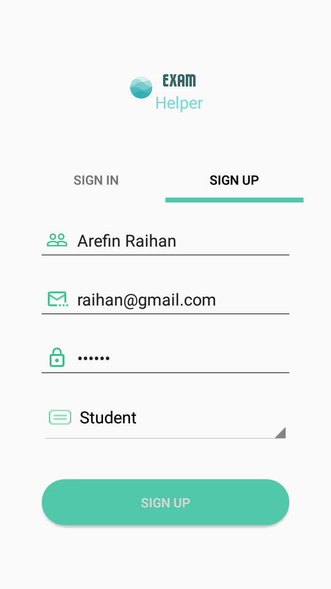
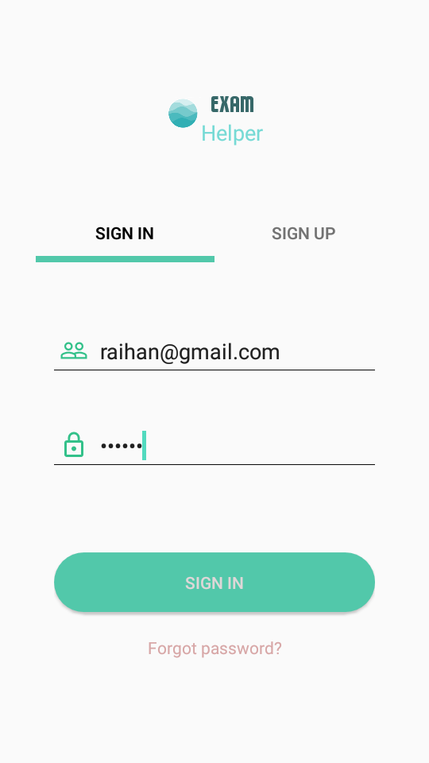
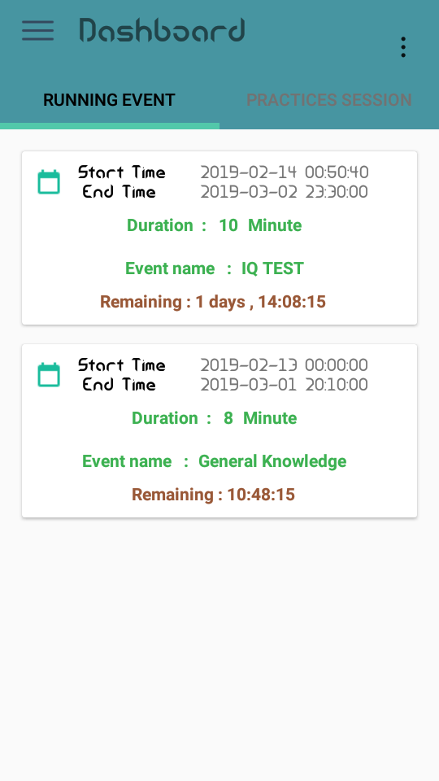
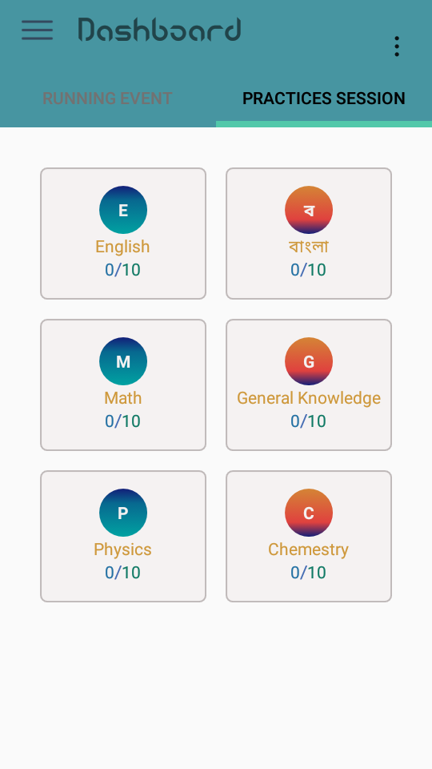
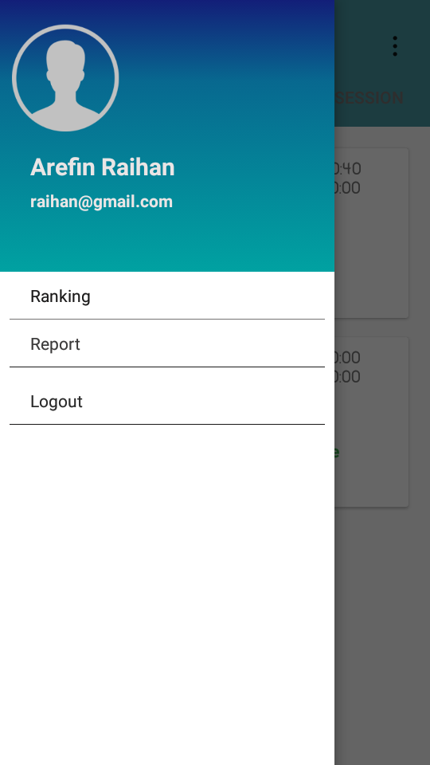

This is ExamHelper android and web base  application for help to easily test for a students. It can be help the teacher for maked a questions and events .Teachers controll her event .
We don't have to share project code for security reasons 
So that i am share this project screenshorts 

<html>
	

		<table width="200px">
			<tr>
				<td>
					
				</td>
				<td>
					
				</td>
				<td>
					
				</td>
			</tr>
			<tr>
				<td>
					
				</td>
				<td>
					
				</td>
				<td>
					
				</td>
			</tr>
		</table>
	

</html>

